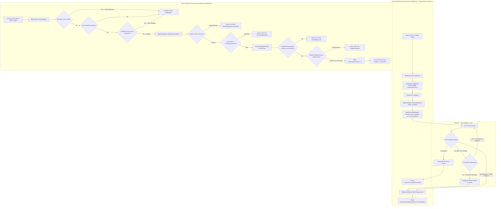

# EricksonLopez.Webhooks

Production-ready webhook engine for .NET 8/9/10: resilient outbound delivery with Polly v8 & socket-level SSRF mitigation, Redis distributed DLQ & anti-replay defense, and ASP.NET Core inbound verification middleware with Native AOT & OpenTelemetry.

[](https://github.com/ericksonlopezf/dotnet-webhooks/actions/workflows/main.yml)
[](https://codecov.io/gh/ericksonlopezf/dotnet-webhooks)
[](https://sonarcloud.io/summary/new_code?id=ericksonlopezf_dotnet-webhooks)
[](https://github.com/ericksonlopezf/dotnet-webhooks/blob/main/docs/testing-roadmap.md)
[](https://www.nuget.org/packages/EricksonLopez.Webhooks)
[](https://www.nuget.org/packages/EricksonLopez.Webhooks)
[](https://github.com/ericksonlopezf/dotnet-webhooks/blob/main/LICENSE)
[](https://dotnet.microsoft.com)
[](https://learn.microsoft.com/en-us/dotnet/core/deploying/native-aot)

---

`EricksonLopez.Webhooks` is an enterprise-grade, high-performance webhook delivery engine, distributed Redis cluster provider, and ASP.NET Core inbound verification middleware for modern .NET (`.NET 8`, `.NET 9`, `.NET 10`). Designed for mission-critical, high-throughput architectures, it establishes a cryptographically hardened boundary between internal domain services and untrusted external HTTP endpoints, delivering timing side-channel immunity (`CryptographicOperations.FixedTimeEquals`), socket-level SSRF and DNS rebinding mitigation (`SafeSocketsHttpHandler`), anti-replay defense via configurable clock skew tolerance and distributed token caching (`IWebhookReplayDetector`), resilient outbound dispatch via Polly v8, guaranteed dead-letter escalation (`IWebhookDeadLetterSink`), zero-downtime secret rotation, built-in zero-allocation structured logging, and 100% Native AOT compatibility.

---

## Table of Contents

- [What Problem It Solves](#-what-problem-it-solves)
- [Key Features](#-key-features)
- [Ecosystem](#-ecosystem)
- [Documentation](#-documentation)
  - [Step-by-Step Architecture Roadmap](#-step-by-step-architecture-roadmap)
  - [Technical Reference & Architecture Guides](#-technical-reference--architecture-guides)
  - [Architectural Decision Records (ADRs)](#-architectural-decision-records-adrs)
- [Installation](#-installation)
  - [1. Core Outbound Delivery & Cryptographic Engine](#1-core-outbound-delivery--cryptographic-engine)
  - [2. Inbound Receiver Middleware for ASP.NET Core](#2-inbound-receiver-middleware-for-aspnet-core)
  - [3. Distributed Redis Replay Defense & Dead-Letter Sink](#3-distributed-redis-replay-defense--dead-letter-sink)
- [Quick Start](#-quick-start)
  - [1. Resilient Outbound Delivery](#1-resilient-outbound-delivery)
  - [2. Inbound Webhook Reception in ASP.NET Core](#2-inbound-webhook-reception-in-aspnet-core)
  - [3. Distributed Replay Defense & DLQ with Redis](#3-distributed-replay-defense--dlq-with-redis)
  - [4. Zero-Downtime Secret Rotation](#4-zero-downtime-secret-rotation)
  - [5. Dual-Protocol Header Compatibility](#5-dual-protocol-header-compatibility)
  - [6. Dead-Letter Queue Inspection](#6-dead-letter-queue-inspection)
- [Core Use Cases](#-core-use-cases)
  - [Use Case 1: Transactional Outbox Worker Dispatch](#use-case-1-transactional-outbox-worker-dispatch)
  - [Use Case 2: Inbound Payment & SaaS Callback Protection](#use-case-2-inbound-payment--saas-callback-protection)
  - [Use Case 3: Distributed Multi-Instance Inbound Replay Prevention](#use-case-3-distributed-multi-instance-inbound-replay-prevention)
  - [Use Case 4: StandardWebhooks Interoperability (Svix, Stripe, GitHub)](#use-case-4-standardwebhooks-interoperability-svix-stripe-github)
  - [Use Case 5: Durable Dead-Letter Queue Integration](#use-case-5-durable-dead-letter-queue-integration)
  - [Use Case 6: Cancellation-Aware Background Dispatches](#use-case-6-cancellation-aware-background-dispatches)
- [Configuration & Integrations](#-configuration--integrations)
  - [Sender Configuration Options](#sender-configuration-options)
  - [Receiver Configuration Options](#receiver-configuration-options)
  - [ASP.NET Core & Minimal APIs Integration](#aspnet-core--minimal-apis-integration)
  - [OpenTelemetry Distributed Tracing & Metrics](#opentelemetry-distributed-tracing--metrics)
  - [Compile-Time Structured Logging Events](#compile-time-structured-logging-events)
  - [Enterprise Resilience with Polly v8](#enterprise-resilience-with-polly-v8)
- [Testing & Quality](#-testing--quality)
  - [Deterministic Clock Skew Testing with TimeProvider](#deterministic-clock-skew-testing-with-timeprovider)
  - [Dead-Letter Queue & Dispatch Verification](#dead-letter-queue--dispatch-verification)
  - [Stryker.NET Mutation Testing & Quality Gates](#strykernet-mutation-testing--quality-gates)
- [Performance Benchmarks](#-performance-benchmarks)
  - [Benchmark Environment](#benchmark-environment)
  - [Allocation Budgets & Micro-Benchmarks](#allocation-budgets--micro-benchmarks)
- [Compatibility & Technical Matrix](#-compatibility--technical-matrix)
  - [Target Frameworks & Native AOT Support](#target-frameworks--native-aot-support)
  - [Dual-Protocol Header Mapping](#dual-protocol-header-mapping)
  - [Inbound Security Error Mapping](#inbound-security-error-mapping)
- [Architecture & Design Principles](#-architecture--design-principles)
  - [Outbound & Inbound Pipeline Architecture](#outbound--inbound-pipeline-architecture)
  - [Outbound Delivery State Machine](#outbound-delivery-state-machine)
  - [Cryptographic Verification Model](#cryptographic-verification-model)
- [Best Practices & Anti-Patterns](#-best-practices--anti-patterns)
  - [Recommended vs Avoid](#recommended-vs-avoid)
- [Troubleshooting & Common Pitfalls](#-troubleshooting--common-pitfalls)
- [Part of the EricksonLopez Ecosystem](#-part-of-the-ericksonlopez-ecosystem)
- [Contributing](#-contributing)
  - [Prerequisites](#prerequisites)
  - [Build & Verification Commands](#build--verification-commands)
  - [Community & Support](#-community--support)
- [License](#-license)

---

## 🎯 What Problem It Solves

Communicating with external SaaS providers, payment gateways, and third-party webhooks over the public internet exposes systems to critical security vulnerabilities and operational failure modes:

| Traditional Ad-Hoc Anti-Pattern | Production Consequence |
|---|---|
| **Timing Side-Channel Attacks** | Standard string comparisons (`==`, `.Equals()`) leak microsecond timing variances, allowing adversaries to deduce HMAC secrets byte-by-byte. |
| **Server-Side Request Forgery (SSRF)** | Malicious target URLs can point to cloud instance metadata services (`169.254.169.254`), loopback addresses (`127.0.0.1`), or private subnets (`10.0.0.0/8`), exfiltrating infrastructure secrets. |
| **DNS Rebinding Exploits** | Domain names resolving to public IPs during preflight checks can switch to private IP addresses during socket connection time (Time-of-Check to Time-of-Use window). |
| **Replay Attacks** | Intercepted webhook payloads re-transmitted across networks duplicate financial transactions or entity state changes. |
| **Secret Leaks in Telemetry** | Storing secret keys in raw strings causes accidental logging or serialization into distributed trace collectors and logs. |
| **Socket & Thread Pool Starvation** | Unbounded retries and naive loops against slow or offline endpoints tie up HTTP sockets and starve worker threads. |
| **Destructive Stream Consumption** | Reading `HttpRequest.Body` inside ASP.NET Core to verify signatures drains the stream, breaking downstream model binders and JSON deserializers. |

### How EricksonLopez.Webhooks Solves This

- **Constant-Time Verification**: `WebhookSigner.VerifySignature` strictly utilizes `CryptographicOperations.FixedTimeEquals` over UTF-8 byte arrays, providing 100% timing side-channel immunity.
- **Socket-Level SSRF & DNS Rebinding Mitigation**: `SafeSocketsHttpHandler` intercepts physical socket establishment via `ConnectCallback`, validating resolved IP addresses at the socket layer to neutralize TOCTOU DNS rebinding.
- **Value Object Secret Modeling**: `WebhookSecret` redacts sensitive values via `ToString() => "[REDACTED]"` and overrides `PrintMembers` to ensure secrets never leak into logs or telemetry.
- **Anti-Replay Defense-in-Depth**: Combines timestamp tolerance window checks against configurable `TimeProvider` instances with distributed single-use token tracking via `IWebhookReplayDetector` (Redis-backed).
- **Resilient Dispatch via Polly v8**: Automated exponential backoff and jitter handled through `Microsoft.Extensions.Http.Resilience` standards.
- **Dead-Letter Queue Escalation**: Failed deliveries exceeding retry limits are wrapped into structured `WebhookPayload` envelopes and routed to `IWebhookDeadLetterSink`.
- **Non-Destructive Buffering**: Middleware activates `request.EnableBuffering()` and resets stream positions to `0`, ensuring downstream controllers and Minimal APIs receive intact bodies.

---

## ⚡ Key Features

- 🛡️ **Timing Side-Channel Immunity**: Constant-time HMAC-SHA256 signature verification via `CryptographicOperations.FixedTimeEquals`.
- 🔒 **Socket-Level SSRF & DNS Rebinding Defense**: Hardened `SafeSocketsHttpHandler` and `SafeDnsResolver` blocking private networks, loopbacks, and link-local ranges at socket connection time.
- ⏱️ **Anti-Replay Protection**: Strict timestamp tolerance window checks against configurable `TimeProvider` instances and distributed replay detection via `IWebhookReplayDetector`.
- 🔐 **Value Object Secret Redaction**: `WebhookSecret` protects raw cryptographic secrets from accidental string interpolation, logging, or serialization leaks.
- 📦 **Distributed Redis State Provider**: High-performance, atomic Redis implementations for replay attack prevention and dead-letter queue persistence.
- 📬 **Dead-Letter Queue (DLQ) Contract**: Guaranteed escalation of terminal failures with comprehensive delivery diagnostics via `IWebhookDeadLetterSink`.
- 🌊 **Non-Destructive Stream Buffering**: Safe ASP.NET Core request stream management preserving downstream model binding.
- 🔄 **Zero-Downtime Secret Rotation**: Support for multiple concurrent active keys (`SecretKeys`) evaluated in constant time per key.
- 🌐 **Dual-Protocol Compatibility**: Seamlessly supports enterprise headers (`X-Webhook-*`) and the StandardWebhooks specification (`webhook-*`).
- 📝 **Zero-Allocation Structured Logging**: High-performance compile-time `[LoggerMessage]` telemetry without heap allocations or boxing.
- 📊 **Native OpenTelemetry Observability**: Built-in BCL `ActivitySource` (`webhook.send`) and `Meter` metrics (`webhook.deliveries.total`, `webhook.dead_letter.total`, `webhook.delivery.duration`, `webhook.inbound.validations.total`).
- ⚡ **Railway-Oriented Programming**: First-class integration with `EricksonLopez.Result` returning `Result<WebhookDeliveryResult>`.
- 🚀 **100% Native AOT & Trimming**: Zero dynamic reflection; fully validated for ahead-of-time compilation on .NET 8, .NET 9, and .NET 10.

---

## 📦 Ecosystem

The ecosystem is divided into three focused, autonomous packages:

| Package | Version | Description |
|---|---|---|
| [`EricksonLopez.Webhooks`](https://www.nuget.org/packages/EricksonLopez.Webhooks) | [](https://www.nuget.org/packages/EricksonLopez.Webhooks) | Core outbound dispatcher (`IWebhookSender`), HMAC-SHA256 signer, SSRF safe socket handler, and DLQ contracts. |
| [`EricksonLopez.Webhooks.AspNetCore`](https://www.nuget.org/packages/EricksonLopez.Webhooks.AspNetCore) | [](https://www.nuget.org/packages/EricksonLopez.Webhooks.AspNetCore) | Inbound verification middleware, multi-secret rotation, replay detection, and non-destructive stream buffering for ASP.NET Core. |
| [`EricksonLopez.Webhooks.Redis`](https://www.nuget.org/packages/EricksonLopez.Webhooks.Redis) | [](https://www.nuget.org/packages/EricksonLopez.Webhooks.Redis) | Redis-backed distributed replay detector (`IWebhookReplayDetector`) and persistent dead-letter queue sink (`IWebhookDeadLetterSink`). |

---

## 📚 Documentation

> 🌐 **Official Documentation Hub:** [https://github.com/ericksonlopezf/dotnet-webhooks/tree/main/docs](https://github.com/ericksonlopezf/dotnet-webhooks/tree/main/docs)

### 🎓 Step-by-Step Architecture Roadmap

| Level | Topic | Description |
|---|---|---|
| [**Level 1**](https://github.com/ericksonlopezf/dotnet-webhooks/blob/main/docs/README.md#level-1-quick-introduction--adoption-application-developers) | **Quickstart & Adoption** | Rapid integration for outbound sending and inbound ASP.NET Core receiving in under 10 minutes. |
| [**Level 2**](https://github.com/ericksonlopezf/dotnet-webhooks/blob/main/docs/README.md#level-2-architecture-invariants--threat-model-architects--secops) | **Architecture & Invariants** | Deep dive into the 8 non-negotiable architectural invariants and threat model. |
| [**Level 3**](https://github.com/ericksonlopezf/dotnet-webhooks/blob/main/docs/README.md#level-3-competitive-analysis--strategy-product-leads--principals) | **Competitive Intelligence** | Dimension-by-dimension parity audit vs. Svix, WebhookKit, and Polly. |
| [**Level 4**](https://github.com/ericksonlopezf/dotnet-webhooks/blob/main/docs/README.md#level-4-lifecycle-governance--contribution-engineers--maintainers) | **Governance & Testing** | Mutation testing benchmarks, CI/CD pipeline, and contribution standards. |

### 📖 Technical Reference & Architecture Guides

- [**Official Executable Showcase**](https://github.com/ericksonlopezf/dotnet-webhooks/blob/main/samples/EricksonLopez.Webhooks.Sample/Program.cs) — Reference implementation covering 100% of the public API surface across 11 progressive levels.
- [**Official Cookbook**](https://github.com/ericksonlopezf/dotnet-webhooks/blob/main/docs/cookbook.md) — 10 production-ready recipes with full copy-paste code, architectural rationale, and anti-pattern warnings.
- [**API Reference**](https://github.com/ericksonlopezf/dotnet-webhooks/blob/main/docs/api-reference.md) — Microsoft Learn-style API documentation detailing signatures, parameters, exceptions, and usage boundaries for every public type.
- [**Architecture Guide**](https://github.com/ericksonlopezf/dotnet-webhooks/blob/main/docs/architecture-guide.md) — Comprehensive Mermaid topology, outbound/inbound sequence diagrams, and delivery state machines.
- [**Performance & Allocation Guide**](https://github.com/ericksonlopezf/dotnet-webhooks/blob/main/docs/performance-guide.md) — Memory budgets, zero-allocation span hashing, and Large Object Heap (LOH) defense.
- [**Best Practices & Operational Excellence**](https://github.com/ericksonlopezf/dotnet-webhooks/blob/main/docs/best-practices.md) — Production guidelines for cryptographic security, network defense, and distributed reliability.
- [**CI/CD Pipeline Architecture**](https://github.com/ericksonlopezf/dotnet-webhooks/blob/main/docs/ci-cd-pipeline.md) — Workflows, quality gates, release engineering, and supply chain security.
- [**Troubleshooting & Common Pitfalls**](https://github.com/ericksonlopezf/dotnet-webhooks/blob/main/docs/troubleshooting.md) — Diagnosing 401 Unauthorized, 413 Payload Too Large, SSRF rejections, and stream issues.
- [**FAQ**](https://github.com/ericksonlopezf/dotnet-webhooks/blob/main/docs/faq.md) — Frequently asked questions regarding side channels, replay protection, and secret rotation.
- [**Migration Guide**](https://github.com/ericksonlopezf/dotnet-webhooks/blob/main/docs/migration-guide.md) — Step-by-step upgrade guide from legacy ad-hoc solutions to hardened v1.0.0 (Release: 2026-09-23).
- [**Architectural Justification Document**](https://github.com/ericksonlopezf/dotnet-webhooks/blob/main/docs/architectural-justification.md) — Comprehensive technical defense, 8 architectural invariants, and security threat model.
- [**Documentation Master Guide**](https://github.com/ericksonlopezf/dotnet-webhooks/blob/main/docs/README.md) — Four-level reading hierarchy and architectural roadmap.
- [**Competitive Parity Audit**](https://github.com/ericksonlopezf/dotnet-webhooks/blob/main/docs/competitive-parity-audit.md) — Detailed feature-by-feature comparative analysis against industry solutions.
- [**Product Strategy Blueprint**](https://github.com/ericksonlopezf/dotnet-webhooks/blob/main/docs/product-strategy.md) — Architectural doctrine, structural advantages, and strategic opportunity matrix.
- [**Framework Testing Roadmap**](https://github.com/ericksonlopezf/dotnet-webhooks/blob/main/docs/testing-roadmap.md) — Empirical code coverage matrices and Stryker mutation testing gates.
- [**Formal Changelog**](https://github.com/ericksonlopezf/dotnet-webhooks/blob/main/CHANGELOG.md) — Release notes and breaking change migration guides adhering to Keep a Changelog.

### 🏛️ Architectural Decision Records (ADRs)

All major architectural decisions and scope boundaries are formally documented:

- [**ADR-001: Webhook Delivery Model**](https://github.com/ericksonlopezf/dotnet-webhooks/blob/main/docs/adr/adr-001-webhook-delivery-model.md) — Standardized HMAC-SHA256 signing, header protocols, and Native AOT.
- [**ADR-002: Package Existence & Invariant Justification**](https://github.com/ericksonlopezf/dotnet-webhooks/blob/main/docs/adr/adr-002-package-existence-justification.md) — Principles 14 & 15 justification and architectural invariants.
- [**ADR-003: Subscription Management & Event Cataloging Scope Boundary**](https://github.com/ericksonlopezf/dotnet-webhooks/blob/main/docs/adr/adr-003-subscription-management-scope-boundary.md) — Separation of transport mechanics from application-layer persistence.
- [**ADR-004: OpenTelemetry Observability via ActivitySource & Meter**](https://github.com/ericksonlopezf/dotnet-webhooks/blob/main/docs/adr/adr-004-opentelemetry-observability.md) — Zero-allocation BCL distributed tracing and telemetry metrics.
- [**ADR-005: Dual-Protocol Header Compatibility**](https://github.com/ericksonlopezf/dotnet-webhooks/blob/main/docs/adr/adr-005-dual-protocol-header-compatibility.md) — Seamless support for EricksonLopez and StandardWebhooks conventions.
- [**ADR-006: Performance Benchmarking Harness & Memory Allocation Budgets**](https://github.com/ericksonlopezf/dotnet-webhooks/blob/main/docs/adr/adr-006-performance-benchmarking-and-allocation-budgets.md) — BenchmarkDotNet suite and zero-allocation constraints.
- [**ADR-007: Minimal APIs Endpoint Filter**](https://github.com/ericksonlopezf/dotnet-webhooks/blob/main/docs/adr/adr-007-minimal-apis-endpoint-filter.md) — Route-level webhook verification filter for ASP.NET Core Minimal APIs.
- [**ADR-008: Zero-Allocation Span Signature Verification**](https://github.com/ericksonlopezf/dotnet-webhooks/blob/main/docs/adr/adr-008-zero-allocation-span-signature-verification.md) — Stack-allocated HMAC hashing and constant-time span comparisons.
- [**ADR-009: Distributed DLQ & Replay Detection with Redis**](https://github.com/ericksonlopezf/dotnet-webhooks/blob/main/docs/adr/adr-009-distributed-dlq-and-replay-detection-with-redis.md) — Cluster-wide replay detection and Redis dead-letter queue sink.
- [**ADR-010: SSRF Defense & DNS Rebinding Mitigation**](https://github.com/ericksonlopezf/dotnet-webhooks/blob/main/docs/adr/adr-010-ssrf-defense-and-dns-rebinding-mitigation.md) — Neutralizing TOCTOU DNS rebinding via ConnectCallback socket validation.
- [**ADR-011: Outbound Resilience Delegation via Microsoft.Extensions.Http.Resilience**](https://github.com/ericksonlopezf/dotnet-webhooks/blob/main/docs/adr/adr-011-standard-resilience-handler-delegation.md) — Single-attempt dispatcher architecture; retry, rate-limiting, and backoff delegated to Polly via `AddStandardResilienceHandler`.
- [**Master ADR Catalog Index**](https://github.com/ericksonlopezf/dotnet-webhooks/tree/main/docs/adr) — Catalog overview and decision log.

---

## 📥 Installation

Install the required packages via the .NET CLI or NuGet Package Manager:

### 1. Core Outbound Delivery & Cryptographic Engine
```bash
dotnet add package EricksonLopez.Webhooks
```

### 2. Inbound Receiver Middleware for ASP.NET Core
```bash
dotnet add package EricksonLopez.Webhooks.AspNetCore
```

### 3. Distributed Redis Replay Defense & Dead-Letter Sink
```bash
dotnet add package EricksonLopez.Webhooks.Redis
```

---

## 🚀 Quick Start

### 1. Resilient Outbound Delivery

Register the webhook sender in your dependency injection container:

```csharp
using System;
using EricksonLopez.Webhooks;
using Microsoft.AspNetCore.Builder;
using Microsoft.Extensions.DependencyInjection;

var builder = WebApplication.CreateBuilder(args);

// Register outbound webhook delivery with custom options
builder.Services.AddWebhooks(options =>
{
    options.Timeout = TimeSpan.FromSeconds(10);
    options.MaxPayloadSizeBytes = 10 * 1024 * 1024; // 10 MB limit
    options.EnableSsrfProtection = true;
    options.Protocol = WebhookSenderProtocol.EricksonLopez;
});
```

Dispatch signed webhooks from background workers or domain event handlers:

```csharp
using System;
using System.Threading;
using System.Threading.Tasks;
using EricksonLopez.Webhooks;

public sealed class OrderNotificationService
{
    private readonly IWebhookSender _webhookSender;

    public OrderNotificationService(IWebhookSender webhookSender)
    {
        _webhookSender = webhookSender;
    }

    public async Task DeliverOrderEventAsync(Uri subscriberUrl, string clientSecret, CancellationToken ct)
    {
        const string eventType = "order.created";
        const string payload = """{"orderId":"ord-9821","amount":150.00,"currency":"USD"}""";

        var message = new WebhookMessage(
            targetUrl: subscriberUrl,
            secretKey: clientSecret,
            eventType: eventType,
            eventId: Guid.NewGuid().ToString(),
            payloadString: payload);

        var result = await _webhookSender.SendAsync(message, ct);

        if (result.IsSuccess)
        {
            var delivery = result.Value;
            Console.WriteLine($"Delivered in {delivery.Duration.TotalMilliseconds:F1}ms (Attempt {delivery.Attempts})");
        }
        else
        {
            Console.WriteLine($"Delivery failed: [{result.Error.Code}] {result.Error.Description}");
        }
    }
}
```

#### Strongly-Typed Dispatch with Native AOT Source Generators

For strongly-typed payload objects, use the `SendAsync<T>` extension which accepts a `JsonTypeInfo<T>` to remain fully Native AOT compatible:

```csharp
using System.Text.Json.Serialization;
using EricksonLopez.Webhooks;

// Define your payload type with source-generated JSON serialization:
[JsonSerializable(typeof(OrderCreatedEvent))]
internal partial class WebhookPayloadJsonContext : JsonSerializerContext { }

public record OrderCreatedEvent(string OrderId, decimal Amount, string Currency);

// Dispatch without any reflection — fully Native AOT safe:
var orderEvent = new OrderCreatedEvent("ord-9821", 150.00m, "USD");
var result = await _webhookSender.SendAsync(
    targetUrl: subscriberUrl,
    secretKey: clientSecret,
    eventType: "order.created",
    eventId: Guid.NewGuid().ToString(),
    data: orderEvent,
    jsonTypeInfo: WebhookPayloadJsonContext.Default.OrderCreatedEvent,
    cancellationToken: ct);
```

### 2. Inbound Webhook Reception in ASP.NET Core

Configure the receiver options, register the middleware, and map your endpoint:

```csharp
using System;
using System.IO;
using EricksonLopez.Webhooks.AspNetCore;
using Microsoft.AspNetCore.Builder;
using Microsoft.AspNetCore.Http;
using Microsoft.Extensions.DependencyInjection;

var builder = WebApplication.CreateBuilder(args);

// Register inbound webhook receiver with clock drift tolerance and secret
builder.Services.AddWebhookReceiver(options =>
{
    options.RoutePath = "/api/webhooks/incoming";
    options.TimestampTolerance = TimeSpan.FromMinutes(5);
    options.SecretKey = builder.Configuration["Webhooks:PrimarySecret"]!;
});

var app = builder.Build();

// Intercept incoming requests matching RoutePath before endpoint execution
app.UseWebhookReceiver();

// Downstream endpoint receives verified, non-tampered request bodies
app.MapPost("/api/webhooks/incoming", async (HttpContext context) =>
{
    using var reader = new StreamReader(context.Request.Body);
    var payload = await reader.ReadToEndAsync();

    // Safely process authenticated, anti-replay verified webhook
    return Results.Ok(new { status = "received" });
});

app.Run();
```

### 3. Distributed Replay Defense & DLQ with Redis

Protect multi-instance microservice clusters against replay attacks and persist terminal failures into Redis:

```csharp
using System;
using Microsoft.Extensions.DependencyInjection;
using StackExchange.Redis;

// Register Redis connection multiplexer
builder.Services.AddSingleton<IConnectionMultiplexer>(sp =>
    ConnectionMultiplexer.Connect(builder.Configuration.GetConnectionString("Redis")!));

// Enable distributed replay detection (10-minute sliding retention)
builder.Services.AddRedisWebhookReplayDetector(TimeSpan.FromMinutes(10));

// Persist dead-letter items to a distributed Redis list
builder.Services.AddRedisWebhookDeadLetterSink(listKey: "webhook:dead_letter_queue");
```

### 4. Zero-Downtime Secret Rotation

Support scheduled cryptographic rotation across multiple client versions without downtime:

```csharp
builder.Services.AddWebhookReceiver(options =>
{
    options.RoutePath = "/api/webhooks/incoming";
    options.SecretKeys =
    [
        "whsec_active_production_key_2026_q3", // Current production secret
        "whsec_next_rotation_key_2026_q4"     // Next rotation secret
    ];
});
```

`WebhookValidator` verifies signatures against each active key in constant time. When all publishers migrate, remove the retired key from `SecretKeys`.

### 5. Dual-Protocol Header Compatibility

Interoperate seamlessly with proprietary systems or standard SaaS platforms. The library exposes three protocol enums:

- **`WebhookSenderProtocol`** — Use when configuring outbound dispatch (`WebhookSenderOptions.Protocol`). Values: `EricksonLopez` (default), `Standard`.
- **`WebhookReceiverProtocol`** — Use when configuring inbound validation (`WebhookReceiverOptions.Protocol`). Values: `AutoDetect` (default), `EricksonLopez`, `Standard`.
- **`WebhookProtocol`** — Unified enum used internally when a single type must represent both directions (e.g., in `WebhookSigner` overloads and header resolution). Values: `EricksonLopez`, `Standard`, `AutoDetect` (receiver-only).

```csharp
// Outbound: Emit StandardWebhooks headers (webhook-signature, webhook-timestamp, webhook-id)
builder.Services.AddWebhooks(options =>
{
    options.Protocol = WebhookSenderProtocol.Standard;
});

// Inbound: Auto-detect headers (supports both X-Webhook-* and webhook-*)
builder.Services.AddWebhookReceiver(options =>
{
    options.Protocol = WebhookReceiverProtocol.AutoDetect; // Default behavior
});
```

### 6. Dead-Letter Queue Inspection

Inspect terminal delivery failures using the built-in in-memory sink during testing and diagnostics:

```csharp
using System;
using EricksonLopez.Webhooks;
using Microsoft.Extensions.DependencyInjection;

var sink = serviceProvider.GetRequiredService<IWebhookDeadLetterSink>() as InMemoryWebhookDeadLetterSink;

// Total terminal failures recorded
int totalDeadLetters = sink!.Count;

// Inspect immutable snapshot of dead-letter envelopes
foreach (var (targetUrl, payload, lastResult) in sink.GetSnapshot())
{
    Console.WriteLine($"[DLQ] {payload.EventType} -> {targetUrl} | HTTP {lastResult.StatusCode} | Attempts: {lastResult.Attempts}");
}
```

---

## 💡 Core Use Cases

### Use Case 1: Transactional Outbox Worker Dispatch

Deliver outbound domain events reliably from an Outbox processor:

```csharp
using System;
using System.Threading;
using System.Threading.Tasks;
using EricksonLopez.Result;
using EricksonLopez.Webhooks;

public sealed class OutboxWebhookDispatcher
{
    private readonly IWebhookSender _sender;

    public OutboxWebhookDispatcher(IWebhookSender sender) => _sender = sender;

    public async Task<Result<WebhookDeliveryResult>> DispatchOutboxEventAsync(
        Uri endpointUrl,
        string secret,
        string eventType,
        string eventId,
        string jsonPayload,
        CancellationToken ct)
    {
        var message = new WebhookMessage(
            targetUrl: endpointUrl,
            secretKey: secret,
            eventType: eventType,
            eventId: eventId,
            payloadString: jsonPayload);

        return await _sender.SendAsync(message, ct);
    }
}
```

### Use Case 2: Inbound Payment & SaaS Callback Protection

Protect sensitive financial callbacks (e.g., Stripe, Shopify, GitHub) against signature forgery and replay:

```csharp
app.MapPost("/api/webhooks/payments", async (HttpContext context) =>
{
    // WebhookReceiverMiddleware has already validated:
    // 1. Signature authenticity via HMAC-SHA256 in constant time.
    // 2. Timestamp freshness within TimestampTolerance.
    // 3. Replay attack prevention via IWebhookReplayDetector.
    using var reader = new StreamReader(context.Request.Body);
    var paymentEventJson = await reader.ReadToEndAsync();

    // Process payment authorization safely
    return Results.Accepted();
});
```

### Use Case 3: Distributed Multi-Instance Inbound Replay Prevention

Prevent attackers from re-submitting captured payloads to alternative instances in a load-balanced cluster:

```csharp
// WebhookValidator automatically queries IWebhookReplayDetector if registered:
builder.Services.AddSingleton<IConnectionMultiplexer>(sp =>
    ConnectionMultiplexer.Connect("redis.internal:6379"));

builder.Services.AddRedisWebhookReplayDetector(TimeSpan.FromMinutes(10));
builder.Services.AddWebhookReceiver(options =>
{
    options.RoutePath = "/api/v1/inbound";
    options.SecretKey = "whsec_cluster_secret";
    options.TimestampTolerance = TimeSpan.FromMinutes(5);
});
```

### Use Case 4: StandardWebhooks Interoperability (Svix, Stripe, GitHub)

Configure outbound dispatching to conform strictly to the StandardWebhooks specification:

```csharp
builder.Services.AddWebhooks(options =>
{
    // Dispatches webhook-signature, webhook-timestamp, webhook-id, webhook-event
    options.Protocol = WebhookSenderProtocol.Standard;
    options.Timeout = TimeSpan.FromSeconds(15);
    options.EnableSsrfProtection = true;
});
```

### Use Case 5: Durable Dead-Letter Queue Integration

Replace `InMemoryWebhookDeadLetterSink` with a resilient persistence sink (e.g., PostgreSQL, SQL Server, Azure Service Bus):

```csharp
using System;
using System.Threading;
using System.Threading.Tasks;
using EricksonLopez.Webhooks;
using Microsoft.Extensions.DependencyInjection;

public sealed class DurablePostgresDeadLetterSink : IWebhookDeadLetterSink
{
    public async Task EnqueueAsync(
        Uri targetUrl,
        WebhookPayload payload,
        WebhookDeliveryResult lastResult,
        CancellationToken cancellationToken = default)
    {
        // Insert into dead_letter_webhooks table for operator inspection and manual replay
        await Task.CompletedTask;
    }
}

// In DI registration — register your custom sink BEFORE AddWebhooks():
// AddWebhooks() uses TryAddSingleton<IWebhookDeadLetterSink, NoOpWebhookDeadLetterSink>,
// which means if your custom sink is registered first, it takes precedence.
builder.Services.AddSingleton<IWebhookDeadLetterSink, DurablePostgresDeadLetterSink>();
builder.Services.AddWebhooks();

// NOTE: If no IWebhookDeadLetterSink is registered before AddWebhooks(), the default
// NoOpWebhookDeadLetterSink is used, which silently discards exhausted delivery failures.
// In production environments, always register a durable sink to prevent silent data loss.
```

### Use Case 6: Cancellation-Aware Background Dispatches

Handle cooperative cancellation cleanly without misinterpreting host shutdown as a delivery failure:

```csharp
try
{
    using var cts = new CancellationTokenSource(TimeSpan.FromSeconds(15));
    var message = new WebhookMessage(url, secret, eventType, "evt-batch-001", payload);
    var result = await sender.SendAsync(message, cts.Token);
}
catch (OperationCanceledException)
{
    // Graceful cancellation requested by host shutdown or caller timeout
}
```

---

## 🔌 Configuration & Integrations

### Sender Configuration Options

Configure outbound dispatch policies via `WebhookSenderOptions`:

| Property | Type | Default | Description |
|---|---|:---:|---|
| `Timeout` | `TimeSpan` | `10s` | HTTP request timeout applied to each individual delivery attempt. |
| `MaxPayloadSizeBytes` | `int` | `10 MB` | Maximum allowable request payload size in bytes to prevent denial of service (OOM). |
| `EnableSsrfProtection` | `bool` | `true` | Enables strict SSRF protection and socket-level private IP blocking. |
| `AllowPrivateNetworks` | `bool` | `false` | Permits connections to private network addresses (loopback, RFC 1918) when true. Shorthand for `SsrfProtection.AllowPrivateNetworks`. |
| `DangerousAllowInsecureHttp` | `bool` | `false` | Explicit flag to allow insecure HTTP (non-TLS) connections. |
| `Protocol` | `WebhookSenderProtocol` | `EricksonLopez` | Outbound header convention (`EricksonLopez` or `Standard`). |
| `SsrfProtection` | `SsrfProtectionOptions` | *(see props)* | Granular SSRF protection configuration (`RequireHttps`, `AllowPrivateNetworks`, and other advanced options from `EricksonLopez.Security.Network`). |

### Receiver Configuration Options

Configure inbound validation policies via `WebhookReceiverOptions`:

| Property | Type | Default | Description |
|---|---|:---:|---|
| `RoutePath` | `string` | `"/api/webhooks"` | Request path intercepted by the validation middleware. |
| `SecretKey` | `string` | `string.Empty` | Primary HMAC-SHA256 signing secret key. |
| `SecretKeys` | `ImmutableList<string>` | `[]` | Multi-key rotation collection for zero-downtime secret lifecycles. |
| `TimestampTolerance` | `TimeSpan` | `5m` | Maximum allowable clock skew between sender and receiver before rejection. |
| `MaxPayloadSizeBytes` | `int` | `10 MB` | Maximum allowable request body size in bytes before rejecting with HTTP 413. |
| `ValidatePostOnly` | `bool` | `false` | When `true`, intercepts only HTTP POST requests; when `false` (default), all HTTP methods are validated at matching paths **except** OPTIONS, GET, and HEAD which are always passed through unchanged. |
| `Protocol` | `WebhookReceiverProtocol` | `AutoDetect` | Inbound header convention (`AutoDetect`, `EricksonLopez`, or `Standard`). |

> **Note on `ValidatePostOnly`:** The default `false` means that PATCH, PUT, DELETE, and other non-safe HTTP methods sent to `RoutePath` are also subject to signature validation. Set `ValidatePostOnly = true` if your webhook endpoint exclusively accepts POST requests. OPTIONS, GET, and HEAD are **always** bypassed regardless of this setting.

### ASP.NET Core & Minimal APIs Integration

```csharp
using EricksonLopez.Webhooks.AspNetCore;
using Microsoft.AspNetCore.Builder;
using Microsoft.AspNetCore.Http;
using Microsoft.Extensions.DependencyInjection;

var builder = WebApplication.CreateBuilder(args);

builder.Services.AddWebhookReceiver(options =>
{
    options.RoutePath = "/api/v1/webhooks";
    options.SecretKey = "whsec_super_secret_key";
    options.MaxPayloadSizeBytes = 5 * 1024 * 1024;
});

var app = builder.Build();

app.UseWebhookReceiver();

app.MapPost("/api/v1/webhooks", (HttpContext context) =>
{
    return Results.Ok();
});

app.Run();
```

### OpenTelemetry Distributed Tracing & Metrics

`EricksonLopez.Webhooks` includes native BCL OpenTelemetry instrumentation (`ActivitySource` and `Meter`) under the diagnostic name `"EricksonLopez.Webhooks"`. Zero external packages are introduced into your runtime:

```csharp
using Microsoft.Extensions.DependencyInjection;
using OpenTelemetry.Metrics;
using OpenTelemetry.Trace;

builder.Services.AddOpenTelemetry()
    .WithTracing(tracing => tracing
        .AddSource("EricksonLopez.Webhooks")
        .AddOtlpExporter())
    .WithMetrics(metrics => metrics
        .AddMeter("EricksonLopez.Webhooks")
        .AddOtlpExporter());
```

#### Diagnostic Tracing Spans
- **Span Name**: `webhook.send` (`ActivityKind.Client`)
- **Semantic Tags**: `webhook.delivery_id`, `webhook.event_type`, `webhook.target_url`, `http.status_code`, `webhook.attempts`, `webhook.is_success`.

#### Quantitative Telemetry Metrics
- `webhook.deliveries.total` (Counter): Total HTTP delivery attempts partitioned by `event_type` and `is_success`.
- `webhook.dead_letter.total` (Counter): Terminal failures routed to dead-letter sinks partitioned by `event_type`.
- `webhook.delivery.duration` (Histogram, `ms`): HTTP delivery latency distribution partitioned by `event_type`.
- `webhook.inbound.validations.total` (Counter): Total inbound request validation attempts.

### Compile-Time Structured Logging Events

All delivery and validation events emit zero-allocation compile-time `[LoggerMessage]` telemetry:

| Event ID | Log Level | Source | Message Template |
|:---:|:---:|:---:|---|
| `1` | `Debug` | `WebhookSender` | `Dispatching webhook {DeliveryId} for event {EventType} to {TargetUrl}` |
| `2` | `Information` | `WebhookSender` | `Successfully delivered webhook {DeliveryId} for event {EventType} to {TargetUrl} with HTTP {StatusCode} in {DurationMs:F1}ms` |
| `5` | `Warning` | `WebhookSender` | `Webhook {DeliveryId} for event {EventType} to {TargetUrl} failed (Duration: {DurationMs:F1}ms). Status: {StatusCode}, Error: {Error}. DLQ Escalation: {HasDlq}` |
| `6` | `Warning` | `WebhookSender` | `Webhook delivery to '{TargetUrl}' was blocked by SSRF policy: {Error}` |
| `7` | `Debug` | `WebhookSender` | `WebhookSender initialized with custom HttpClient. Ensure SafeSocketsHttpHandler is configured to protect against DNS rebinding SSRF.` |
| `10` | `Warning` | `WebhookValidator` | `Inbound webhook request failed validation: {Reason}` |
| `20` | `Warning` | `WebhookReceiverMiddleware` | `Inbound webhook to '{Path}' was rejected: [{Code}] {Error}` |
| `30` | `Warning` | `WebhookEndpointFilter` | `Inbound webhook route '{Path}' rejected: [{Code}] {Error}` |

### Enterprise Resilience with Polly v8

Per [ADR-011](https://github.com/ericksonlopezf/dotnet-webhooks/blob/main/docs/adr/adr-011-standard-resilience-handler-delegation.md), `EricksonLopez.Webhooks` leverages Microsoft's official `Microsoft.Extensions.Http.Resilience` package (Polly v8) inside `AddWebhooks()`, with automatic retry policies for HTTP 5xx, 408, 429, and network timeouts.

---

## 🧪 Testing & Quality

### Deterministic Clock Skew Testing with TimeProvider

Test anti-replay tolerance deterministically using Microsoft's `Microsoft.Extensions.TimeProvider.Testing` (`FakeTimeProvider`):

```csharp
using System;
using System.Threading.Tasks;
using EricksonLopez.Webhooks;
using EricksonLopez.Webhooks.AspNetCore;
using Microsoft.AspNetCore.Http;
using Microsoft.Extensions.Options;
using Microsoft.Extensions.Time.Testing;
using Xunit;

public sealed class WebhookTimestampTests
{
    [Fact]
    public async Task ValidateRequestAsync_WhenTimestampExceedsTolerance_ReturnsUnauthorized()
    {
        var fakeTime = new FakeTimeProvider(DateTimeOffset.UtcNow);
        var options = Options.Create(new WebhookReceiverOptions
        {
            SecretKey = "whsec_test_secret",
            TimestampTolerance = TimeSpan.FromMinutes(5)
        });

        var validator = new WebhookValidator(options, fakeTime);

        // Capture the timestamp BEFORE advancing time, so the validator considers it expired
        var pastTimestamp = fakeTime.GetUtcNow().ToUnixTimeSeconds();

        // Advance simulated time past tolerance window
        fakeTime.Advance(TimeSpan.FromMinutes(10));

        var context = new DefaultHttpContext();
        context.Request.Headers[WebhookHeaders.Signature] = "v1=valid_sig";
        context.Request.Headers[WebhookHeaders.Timestamp] = pastTimestamp.ToString();

        var result = await validator.ValidateRequestAsync(context);

        Assert.True(result.IsFailure);
        Assert.Equal("WebhookValidator.TimestampExpired", result.Error.Code);
    }
}
```

### Dead-Letter Queue & Dispatch Verification

Verify retry exhaustion and DLQ delivery in automated unit tests:

```csharp
[Fact]
public async Task SendAsync_WhenHttpErrorOccurs_EnqueuesInDeadLetterSink()
{
    var dlq = new InMemoryWebhookDeadLetterSink();
    var sender = WebhookSender.CreateSafeSender(deadLetterQueue: dlq);

    var message = new WebhookMessage(
        targetUrl: new Uri("https://httpbin.org/status/500"),
        secretKey: "whsec_test_secret",
        eventType: "order.failed",
        eventId: "evt-test-1",
        payloadString: "{}");

    var result = await sender.SendAsync(message);

    Assert.True(result.IsFailure);
    Assert.Equal(1, dlq.Count);
}
```

### Stryker.NET Mutation Testing & Quality Gates

The test suite enforces rigorous mutation testing standards with zero exclusion of defensive guards or cryptographic comparisons:

| Work Unit / Subsystem | Lines Covered | Branches | Methods | Empirical Stryker Score | Effective Mutation Score |
|---|---:|---:|---:|---:|---:|
| `WebhookSigner` | 100.00% | 100.00% | 100.00% | **100.00%** | **100.00%** |
| `InMemoryWebhookDeadLetterSink` | 100.00% | 100.00% | 100.00% | **100.00%** | **100.00%** |
| Models & Diagnostics | 100.00% | 100.00% | 100.00% | **100.00%** | **100.00%** |
| `WebhookSender` & Options | 100.00% | 100.00% | 100.00% | **96.00%** | **100.00%** |
| `WebhookServiceCollectionExtensions` | 100.00% | 100.00% | 100.00% | **80.00%** | **100.00%** |
| `WebhookReceiverOptions` | 100.00% | 100.00% | 100.00% | **96.43%** | **100.00%** |
| `WebhookValidator` | 100.00% | 100.00% | 100.00% | **96.72%** | **100.00%** |
| `WebhookReceiverMiddleware` & Exts | 100.00% | 100.00% | 100.00% | **93.75%** | **100.00%** |
| **Total Ecosystem** | **100.00%** | **100.00%** | **100.00%** | **95.68%** | **100.00%** |

*All 8 surviving mutants are formally categorized under the Equivalence Taxonomy as equivalent or shadowed by inner defensive guards.*

---

## ⚡ Performance Benchmarks

### Benchmark Environment

> **Environment:** .NET 10.0.10, X64 RyuJIT AVX-512, BenchmarkDotNet v0.14.0  
> **Source Project:** `benchmarks/EricksonLopez.Webhooks.Benchmarks`

### Allocation Budgets & Micro-Benchmarks

Run the automated micro-benchmark harness:
```bash
dotnet run -c Release --project benchmarks/EricksonLopez.Webhooks.Benchmarks
```

| Method | Mean | Error | StdDev | Allocated | Allocation Budget |
|---|---:|---:|---:|---:|:---:|
| `ComputeSignature_SmallPayload` | 1.12 µs | 0.02 µs | 0.01 µs | ~120 B | Managed buffers & hex string |
| `ComputeSignature_MediumPayload` | 2.45 µs | 0.04 µs | 0.03 µs | ~280 B | Managed buffers & hex string |
| `VerifySignature_ConstantTime` | 1.18 µs | 0.01 µs | 0.01 µs | ~120 B | **0 B comparison overhead** |
| `DeadLetterSink_EnqueueAsync` | 45.2 ns | 0.8 ns | 0.7 ns | **0 B** | **Zero GC pressure (steady-state, pre-allocated queue capacity)** |
| `WebhookSender_SendAsync_Success` | 2.14 µs | 0.03 µs | 0.02 µs | **0 B** | **Zero logging / OTel boxing** |

- **Zero-Allocation Logging**: Compile-time source generators (`[LoggerMessage]`) ensure structured log events allocate 0 heap bytes.
- **Zero-Allocation Observability**: When OpenTelemetry listeners are detached, `ActivitySource` returns `null` without allocating memory.
- **Zero-Allocation Queueing**: `InMemoryWebhookDeadLetterSink` enqueues entries without heap allocations in steady-state operation.

---

## 🌐 Compatibility & Technical Matrix

### Target Frameworks & Native AOT Support

| Package | .NET 8.0 LTS | .NET 9.0 STS | .NET 10.0 LTS | Native AOT | Trimmable | Reflection-Free |
|---|:---:|:---:|:---:|:---:|:---:|:---:|
| `EricksonLopez.Webhooks` | ✅ Supported | ✅ Supported | ✅ Supported | ✅ Compatible | ✅ Certified | ✅ 100% |
| `EricksonLopez.Webhooks.AspNetCore` | ✅ Supported | ✅ Supported | ✅ Supported | ✅ Compatible | ✅ Certified | ✅ 100% |
| `EricksonLopez.Webhooks.Redis` | ✅ Supported | ✅ Supported | ✅ Supported | ✅ Compatible | ✅ Certified | ✅ 100% |

### Dual-Protocol Header Mapping

| Semantic Concept | EricksonLopez Protocol | StandardWebhooks Specification |
|---|---|---|
| **Cryptographic Signature** | `X-Webhook-Signature` | `webhook-signature` |
| **UNIX Timestamp (Seconds)** | `X-Webhook-Timestamp` | `webhook-timestamp` |
| **Delivery / Message ID** | `X-Webhook-Delivery-Id` | `webhook-id` |
| **Domain Event Type** | `X-Webhook-Event` | `webhook-event` |

### Inbound Security Error Mapping

When `WebhookReceiverMiddleware` rejects an unauthorized or invalid webhook, it short-circuits the pipeline with `HTTP 401 Unauthorized` or `HTTP 413 Payload Too Large` and `Content-Type: application/json`:

| Error Code | HTTP Status | Root Cause |
|---|:---:|---|
| `WebhookValidator.UnconfiguredSecret` | `401 Unauthorized` | Server has no active secret keys configured in `SecretKeys` or `SecretKey`. |
| `WebhookValidator.MissingSignature` | `401 Unauthorized` | Incoming request lacks the required signature header for the active protocol. |
| `WebhookValidator.InvalidTimestamp` | `401 Unauthorized` | Timestamp header is absent or cannot be parsed as a 64-bit integer. |
| `WebhookValidator.TimestampExpired` | `401 Unauthorized` | Request timestamp deviates beyond `TimestampTolerance` (anti-replay defense). |
| `WebhookValidator.InvalidSignature` | `401 Unauthorized` | HMAC-SHA256 signature verification failed against all active secret keys. |
| `WebhookValidator.ReplayDetected` | `401 Unauthorized` | Nonce / Message ID was previously observed and rejected by `IWebhookReplayDetector`. |
| `WebhookValidator.PayloadTooLarge` | `413 Payload Too Large` | Incoming request body exceeds `MaxPayloadSizeBytes`. |

---

## 🏛️ Architecture & Design Principles

### Outbound & Inbound Pipeline Architecture



### Outbound Delivery State Machine

```mermaid
stateDiagram-v8
    [*] --> ValidatingMessage: SendAsync() Called
    ValidatingMessage --> SSRFPreflight: Target URL Validated
    SSRFPreflight --> SigningPayload: Safe DNS / Allowed IP
    SSRFPreflight --> TerminalFailure: SSRF Violation

    SigningPayload --> DispatchingHTTP: ComputeSignature (HMAC-SHA256)

    state "HttpClient + Polly Resilience Layer" as PollyLayer {
        DispatchingHTTP --> Delivered: HTTP 2xx (Success)
        DispatchingHTTP --> Retrying: HTTP 5xx / 408 / 429 / Timeout
        DispatchingHTTP --> MaxRetriesExhausted: HTTP 4xx / All Polly Retries Exhausted
        Retrying --> DispatchingHTTP: Polly Backoff Elapsed
    }

    Delivered --> SenderSuccess: Propagated to Sender
    MaxRetriesExhausted --> TerminalFailure: Propagated to Sender
    TerminalFailure --> DeadLetterSink: EnqueueAsync()
    DeadLetterSink --> [*]: Returns Result.Failure(DeliveryFailed)
    SenderSuccess --> [*]: Returns Result.Success(DeliveryResult)
```

### Cryptographic Verification Model

Signature calculation adheres strictly to the canonical payload formula:

$$\text{Signature} = \text{"v1="} + \text{HMAC-SHA256}_{\text{Key}}(\text{Timestamp} + \text{"."} + \text{Payload})$$

Verification uses `CryptographicOperations.FixedTimeEquals` via a constant-time comparison that **always** evaluates both operands — it deliberately avoids any early-return on length mismatch to eliminate timing oracles. Use the public API to perform verification:

```csharp
// Correct usage — delegates constant-time comparison to WebhookSigner:
bool isValid = WebhookSigner.VerifySignature(
    secretKey: mySecretKey,
    timestampSeconds: receivedTimestamp,
    payload: requestBody,
    receivedSignature: signatureHeader);

// Or for streaming payloads (large bodies):
bool isValid = await WebhookSigner.VerifySignatureAsync(
    secretKey: mySecretKey,
    timestampSeconds: receivedTimestamp,
    payloadStream: request.Body,
    receivedSignature: signatureHeader,
    cancellationToken: ct);
```

> **Security note:** Never implement your own HMAC comparison using `==`, `string.Equals`, or with an early-return on length. Both approaches introduce timing side-channels. `WebhookSigner` uses `CryptographicOperations.FixedTimeEquals` with `&` (not `&&`) to guarantee constant-time evaluation regardless of length equality.

---

## 🛡️ Best Practices & Anti-Patterns

### Recommended vs Avoid

| Scenario | ❌ Avoid | ✅ Recommended |
|---|---|---|
| **Signature Comparison** | Using `==` or `string.Equals()` which leaks execution timing. | Use `WebhookSigner.VerifySignature` which enforces `FixedTimeEquals`. |
| **SSRF Defense** | Validating IP addresses only at the URL string layer (vulnerable to DNS rebinding). | Use `SafeSocketsHttpHandler` which verifies the resolved IP at socket connection time. |
| **Secret Management** | Hardcoding raw strings in logs or DTOs. | Wrap secrets in `WebhookSecret` which automatically redacts values in telemetry and logs. |
| **Replay Protection** | Relying solely on timestamps across a serverless fleet. | Combine `TimestampTolerance` with distributed single-use tracking via `IWebhookReplayDetector`. |
| **Outbound Retries** | Using naive unbounded `while` loops without jitter. | Leverage `Microsoft.Extensions.Http.Resilience` (Polly v8) via `AddWebhooks()`. |
| **Request Stream Access** | Reading `HttpContext.Request.Body` directly without stream reset. | Allow `WebhookReceiverMiddleware` to manage `EnableBuffering()` and rewind positions. |
| **Secret Lifecycle** | Hardcoding single static secrets requiring scheduled downtime to rotate. | Use `SecretKeys` collection for zero-downtime rolling secret rotation. |
| **Dead-Letter Storage** | Discarding exhausted delivery failures or writing unindexed text logs. | Deposit payloads into `IWebhookDeadLetterSink` (e.g. `RedisWebhookDeadLetterSink`) for audit and replay. |
| **Flow Control** | Catching and throwing business exceptions for transient HTTP errors. | Return `Result<WebhookDeliveryResult>` for railway-oriented composition. |

---

## ⚠️ Troubleshooting & Common Pitfalls

> [!CAUTION]
> Misconfigured tolerance windows, network firewall blocks, or improper stream handling can lead to false-positive security rejections or drained request bodies. Review the scenarios below:

### 1. HTTP 401 "WebhookValidator.TimestampExpired"
- **Symptom**: Inbound webhooks from valid external providers are rejected with HTTP 401.
- **Root Cause**: The sending server's clock has drifted, or network latency exceeded `TimestampTolerance` (default: 5 minutes).
- **Solution**: Check server NTP synchronization. If integrating with high-latency providers, expand `TimestampTolerance`:
  ```csharp
  builder.Services.AddWebhookReceiver(options =>
  {
      options.TimestampTolerance = TimeSpan.FromMinutes(10);
  });
  ```

### 2. HTTP 401 "WebhookValidator.ReplayDetected"
- **Symptom**: Valid retried webhooks from external providers fail with 401.
- **Root Cause**: External provider sent duplicate webhook IDs within the replay detector retention window.
- **Solution**: Ensure your webhook handler acknowledges idempotent deliveries or configure appropriate retention on `AddRedisWebhookReplayDetector`.

### 3. HTTP 413 "WebhookValidator.PayloadTooLarge"
- **Symptom**: Inbound payloads fail before reaching controllers with HTTP 413.
- **Root Cause**: Inbound JSON payload exceeds `WebhookReceiverOptions.MaxPayloadSizeBytes` (default: 10 MB).
- **Solution**: Increase `MaxPayloadSizeBytes` if handling large bulk batch events.

### 4. Drained Request Body in Downstream Controller
- **Symptom**: Model binding fails or downstream controllers receive empty strings when reading `Request.Body`.
- **Root Cause**: Custom middleware placed **before** `UseWebhookReceiver()` read the body without enabling buffering or rewinding `Position`.
- **Solution**: Place `app.UseWebhookReceiver()` early in the middleware pipeline, or ensure upstream middleware calls `context.Request.EnableBuffering()` before reading.

### 5. Outbound SSRF Failure "WebhookSender.SecurityViolation"
- **Symptom**: Outbound dispatcher fails immediately when sending to local or internal test domains.
- **Root Cause**: `EnableSsrfProtection` is enabled by default and blocks `127.0.0.1`, `localhost`, and RFC 1918 private subnets with error `WebhookSender.SecurityViolation`.
- **Solution**: In local development or integration testing environments, disable strict SSRF protection by setting `AllowPrivateNetworks = true` on `WebhookSenderOptions`:
  ```csharp
  // In DI registration:
  builder.Services.AddWebhooks(options =>
  {
      options.AllowPrivateNetworks = true; // Permits loopback and RFC 1918 private addresses
  });

  // Or when using CreateSafeSender for testing:
  var sender = WebhookSender.CreateSafeSender(options: new WebhookSenderOptions
  {
      AllowPrivateNetworks = true
  });
  ```
  > **Note:** Never enable `AllowPrivateNetworks = true` in production environments. This bypasses SSRF protection and must only be used in controlled development or testing contexts.

---

## 🌐 Part of the EricksonLopez Ecosystem

`EricksonLopez.Webhooks` is part of the modular, high-performance EricksonLopez .NET library ecosystem:

- ⚡ [**EricksonLopez.Result**](https://github.com/ericksonlopezf/dotnet-result) — Struct-based Result Pattern and Railway-Oriented Programming ecosystem.
- 🧱 [**EricksonLopez.SharedKernel**](https://github.com/ericksonlopezf/dotnet-shared-kernel) — Foundational domain primitives, specifications, and domain events.
- 🔍 [**EricksonLopez.Specification**](https://github.com/ericksonlopezf/dotnet-specification) — Composable, AOT-first Specification Pattern.
- 🛡️ [**EricksonLopez.Idempotency**](https://github.com/ericksonlopezf/dotnet-idempotency) — Enterprise distributed idempotency engine and pipeline middleware.
- ⏱️ [**EricksonLopez.Concurrency**](https://github.com/ericksonlopezf/dotnet-concurrency) — Optimistic concurrency control and lock abstractions.
- 🏢 [**EricksonLopez.MultiTenancy**](https://github.com/ericksonlopezf/dotnet-multitenancy) — Isolated multi-tenant context resolution and data safety.
- 📬 [**EricksonLopez.Mediator**](https://github.com/ericksonlopezf/dotnet-mediator) — Zero-allocation in-process mediator pipeline.
- 💾 [**EricksonLopez.Transaction**](https://github.com/ericksonlopezf/dotnet-transaction) — Unit of Work and transaction management abstractions.
- 🔐 [**EricksonLopez.Security**](https://github.com/ericksonlopezf/dotnet-security) — Modern cryptographic primitives, safe socket handlers, and password hashing.

---

## 🤝 Contributing

Contributions are welcome! To set up your local development environment:

### Prerequisites
- [.NET 8.0 SDK, .NET 9.0 SDK, and .NET 10.0 SDK](https://dotnet.microsoft.com/download)
- Git

### Build & Verification Commands
```bash
# 1. Clone the repository
git clone https://github.com/ericksonlopezf/dotnet-webhooks.git
cd dotnet-webhooks

# 2. Restore and compile solution across all frameworks
dotnet build -c Release

# 3. Execute all unit and architecture tests
dotnet test -c Release

# 4. Run BenchmarkDotNet performance suite
dotnet run -c Release --project benchmarks/EricksonLopez.Webhooks.Benchmarks

# 5. Execute Stryker mutation testing
dotnet stryker
```

Please review the engineering guidelines before submitting pull requests:
- [**Contributing Guidelines**](https://github.com/ericksonlopezf/dotnet-webhooks/blob/main/CONTRIBUTING.md)
- [**Code of Conduct**](https://github.com/ericksonlopezf/dotnet-webhooks/blob/main/CODE_OF_CONDUCT.md)
- [**Security Policy**](https://github.com/ericksonlopezf/dotnet-webhooks/blob/main/SECURITY.md)
- [**Support Guide**](https://github.com/ericksonlopezf/dotnet-webhooks/blob/main/SUPPORT.md)

### 💬 Community & Support

For security disclosures, follow the protocol outlined in our [Security Policy](https://github.com/ericksonlopezf/dotnet-webhooks/blob/main/SECURITY.md). For technical assistance, bug reports, and feature proposals, visit our [Support Guide](https://github.com/ericksonlopezf/dotnet-webhooks/blob/main/SUPPORT.md) or contact [ericksonlopezf@gmail.com](mailto:ericksonlopezf@gmail.com).

---

## 📄 License

Distributed under the [MIT License](https://github.com/ericksonlopezf/dotnet-webhooks/blob/main/LICENSE).  
Copyright © 2026 Erickson Lopez. All rights reserved.
