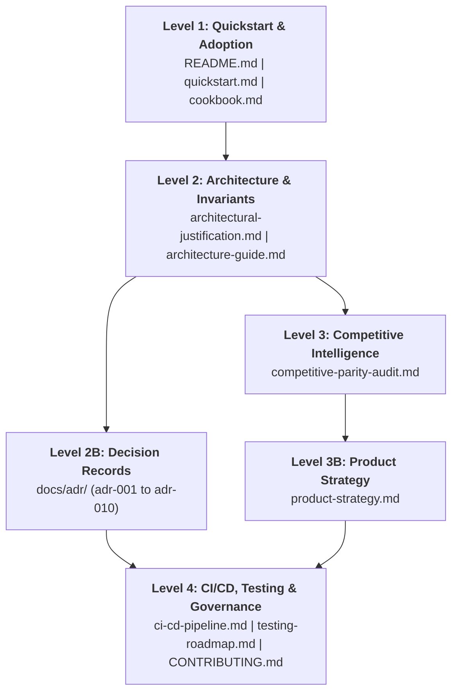

# Documentation Master Guide — EricksonLopez.Webhooks

Welcome to the technical documentation for `EricksonLopez.Webhooks`. To ensure clear comprehension, the documentation is structured in a four-level hierarchy tailored to reader roles and operational goals.

---

## Reading Roadmap & Recommended Sequence

---

### Level 1: Quick Introduction & Adoption (Application Developers)
*Goal: Integrate outbound delivery or inbound receiving into an ASP.NET Core application in under 10 minutes.*
- [README.md](../README.md): Primary library overview, features, and quickstart.
- [Quick Start](quickstart.md): 5-minute practical copy-paste guide for outbound delivery and inbound reception.
- [Getting Started](getting-started.md): Foundational concepts and architecture overview.
- [Official Cookbook](cookbook.md): 10 production-ready recipes with full code and anti-pattern warnings.
- [API Reference](api-reference.md): Microsoft Learn-style API documentation covering 100% of public methods and types.
- [FAQ](faq.md): Frequently asked questions on cryptographic invariants and side channels.
- [Troubleshooting](troubleshooting.md): Diagnosing 401s, 413s, SSRF violations, and stream issues.
- [Migration Guide](migration-guide.md): Migrating from ad-hoc solutions to hardened v1.0.0 (Release: 2026-09-23).
- [Best Practices](best-practices.md): Production operational guidelines.
- [Performance Guide](performance-guide.md): Memory budgets and Large Object Heap (LOH) defense.
- [Architecture Guide](architecture-guide.md): Comprehensive Mermaid topology, sequences, and state machines.
- [Changelog Example](changelog-example.md): Canonical Keep a Changelog sample.

---

### Level 2: Architecture, Invariants & Threat Model (Architects / SecOps)
*Goal: Understand why this library exists, which problems it solves, and the cryptographic invariants it defends.*
- [docs/architectural-justification.md](./architectural-justification.md):
  - Critical failure modes of ad-hoc implementations (timing attacks, replay attacks, socket starvation).
  - The 8 non-negotiable architectural invariants.
  - Threat model and layer topology (Core vs. AspNetCore vs. Redis).
- [docs/adr/README.md](./adr/README.md):
  - **ADR-001**: [Webhook Delivery Model](./adr/adr-001-webhook-delivery-model.md) *(HMAC-SHA256 signing, headers, AOT)*
  - **ADR-002**: [Package Existence Justification](./adr/adr-002-package-existence-justification.md) *(Principles 14/15, invariants, DLQ)*
  - **ADR-003**: [Subscription Management Scope Boundary](./adr/adr-003-subscription-management-scope-boundary.md) *(Scope boundaries and application responsibilities)*
  - **ADR-004**: [OpenTelemetry Observability via ActivitySource & Meter](./adr/adr-004-opentelemetry-observability.md) *(BCL traces and quantitative metrics)*
  - **ADR-005**: [Dual-Protocol Header Compatibility](./adr/adr-005-dual-protocol-header-compatibility.md) *(StandardWebhooks & EricksonLopez)*
  - **ADR-006**: [Performance Benchmarking Harness & Budgets](./adr/adr-006-performance-benchmarking-and-allocation-budgets.md) *(BenchmarkDotNet and memory allocation budgets)*
  - **ADR-007**: [Minimal APIs Endpoint Filter Integration](./adr/adr-007-minimal-apis-endpoint-filter.md) *(Declarative per-route signature enforcement)*
  - **ADR-008**: [Zero-Allocation Span Candidate Tokenization](./adr/adr-008-zero-allocation-span-signature-verification.md) *(Defensive 5-candidate ceiling against CPU DoS)*
  - **ADR-009**: [Distributed Dead-Letter Queue & Anti-Replay Detection via Redis](./adr/adr-009-distributed-dlq-and-replay-detection-with-redis.md) *(Redis provider for clustered deployments)*
  - **ADR-010**: [SSRF Defense & DNS Rebinding Mitigation](./adr/adr-010-ssrf-defense-and-dns-rebinding-mitigation.md) *(Connection-time IP validation and zero-trust network perimeter)*

---

### Level 3: Competitive Analysis & Strategy (Product Leads / Principals)
*Goal: Analyze market positioning against alternatives (Svix, WebhookKit, Polly) and executed engineering initiatives.*
- [competitive-parity-audit.md](./competitive-parity-audit.md):
  - Parity audit against direct and indirect alternatives.
  - Dimension-by-dimension analysis (security, throughput, API ergonomics, AOT, contracts).
- [product-strategy.md](./product-strategy.md):
  - From Feature Matrix to Product Strategy.
  - Structural competitive advantages (`Result<T>`, Native AOT First, Invariant-First Doctrine).
  - Opportunity matrix and technical justification of implemented vs. rejected initiatives.
- [testing-roadmap.md](testing-roadmap.md):
  - Exhaustive testing roadmap, Coverlet coverage goals, and Stryker mutation testing gates.

---

### Level 4: CI/CD, Governance & Contribution (DevOps / Engineers / Maintainers)
*Goal: Understand build pipelines, quality gates, extend the library, and verify performance budgets.*
- [CI/CD Pipeline Guide](ci-cd-pipeline.md):
  - Comprehensive documentation of all 8 GitHub Actions workflows.
  - Quality gates: Coverlet Code Coverage, Stryker Mutation Testing (95% threshold), Benchmark regression gate, CodeQL, and Dependabot.
- [CONTRIBUTING.md](../CONTRIBUTING.md):
  - Engineering standards, zero dynamic reflection, `[LoggerMessage]` compile-time logging.
  - Deterministic clock testing with `FakeTimeProvider` and pull request workflow.
- [SECURITY.md](../SECURITY.md):
  - Vulnerability disclosure policy, supply chain security, and threat model.
- [SUPPORT.md](../SUPPORT.md):
  - Official support channels, response times, and enterprise inquiries.
- [CODE_OF_CONDUCT.md](../CODE_OF_CONDUCT.md):
  - Contributor Covenant 2.1 standards and enforcement guidelines.
- [CHANGELOG.md](../CHANGELOG.md):
  - Formal change history governed by Keep a Changelog.
- **Automated Benchmarks**:
  - `benchmarks/EricksonLopez.Webhooks.Benchmarks/`: Micro-benchmarking harness and memory allocation budget validation with BenchmarkDotNet.
