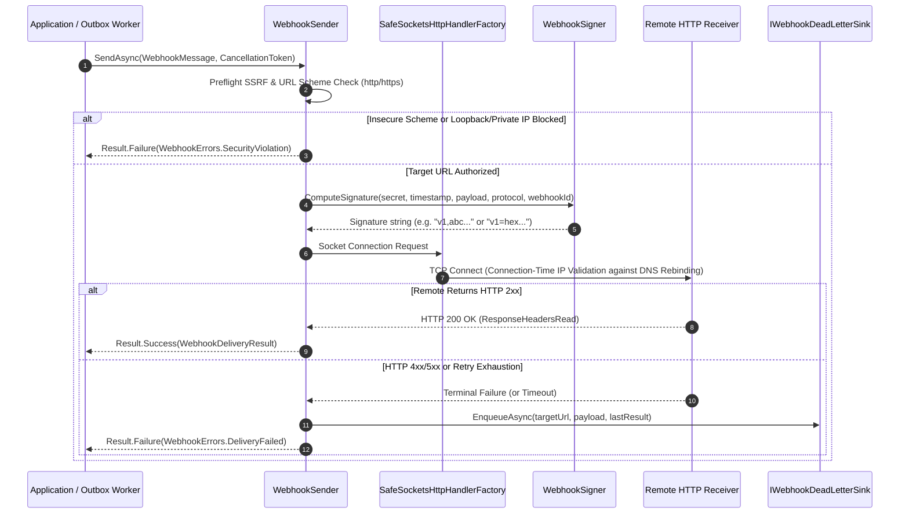
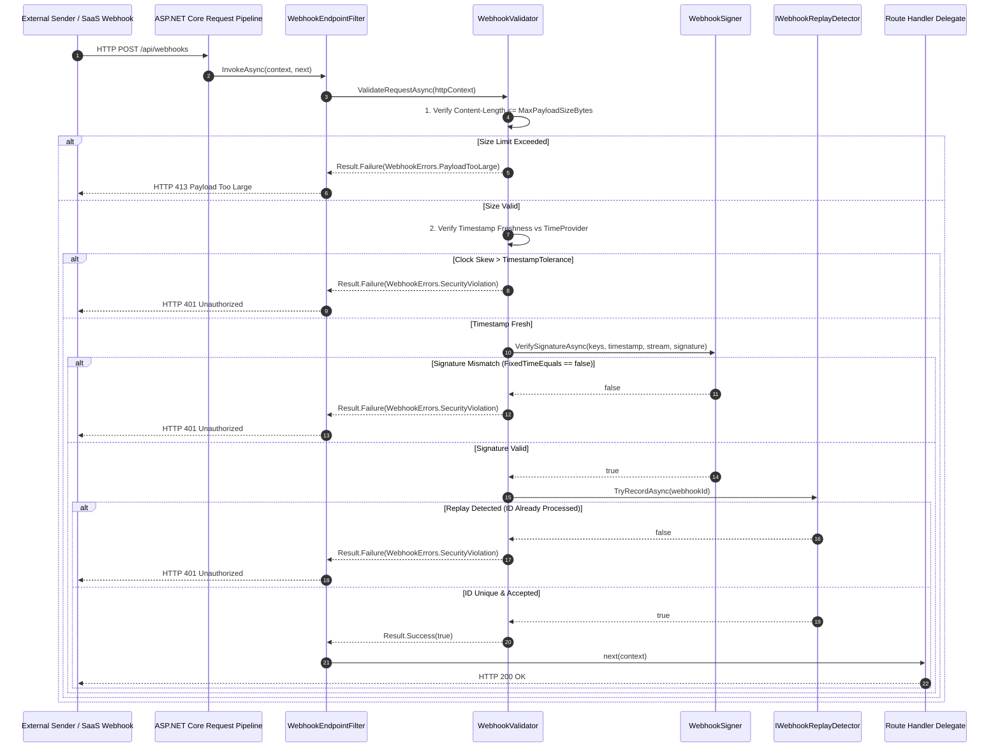
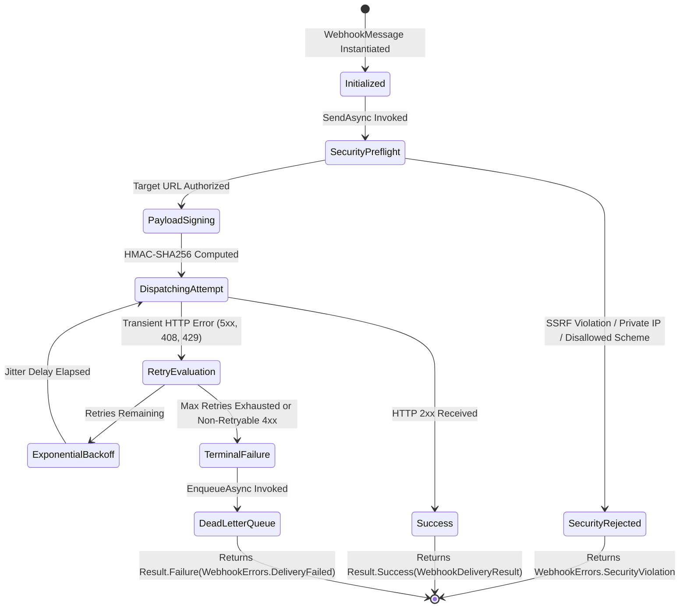

# Architecture Guide — EricksonLopez.Webhooks

This document describes the internal architecture, design principles, layer topology, interaction sequence diagrams, and delivery state machines of `EricksonLopez.Webhooks`.

---

## 1. Layer Topology & Ecosystem Architecture

```mermaid
graph TD
    subgraph Consumers ["Application / Consumer Layer"]
        App["ASP.NET Core Web App / Minimal APIs"]
        Worker["Transactional Outbox Dispatcher Worker"]
    end

    subgraph AspNetCore ["EricksonLopez.Webhooks.AspNetCore"]
        Filter["WebhookEndpointFilter"]
        Middleware["WebhookReceiverMiddleware"]
        Validator["WebhookValidator (IWebhookValidator)"]
        OptionsRx["WebhookReceiverOptions"]
    end

    subgraph Core ["EricksonLopez.Webhooks (Core Engine)"]
        Sender["WebhookSender (IWebhookSender)"]
        Signer["WebhookSigner"]
        Headers["WebhookHeaders"]
        Secret["WebhookSecret"]
        Msg["WebhookMessage & WebhookPayload"]
        Diagnostics["WebhookDiagnostics (ActivitySource & Meter)"]
        Errors["WebhookErrors (Result<T>)"]
        DLQContract["IWebhookDeadLetterSink"]
        ReplayContract["IWebhookReplayDetector"]
        SafeHandler["SafeSocketsHttpHandlerFactory"]
    end

    subgraph Infrastructure ["EricksonLopez.Webhooks.Redis (Provider)"]
        RedisDLQ["RedisWebhookDeadLetterSink"]
        RedisReplay["RedisWebhookReplayDetector"]
        RedisEnvelope["DeadLetterEnvelope & DeadLetterJsonContext"]
    end

    App --> Filter
    App --> Middleware
    Filter --> Validator
    Middleware --> Validator
    Validator --> Signer
    Validator --> ReplayContract
    Validator --> OptionsRx

    Worker --> Sender
    Sender --> SafeHandler
    Sender --> Signer
    Sender --> DLQContract
    Sender --> Diagnostics
    Sender --> Errors

    RedisDLQ -.->|Implements| DLQContract
    RedisReplay -.->|Implements| ReplayContract
```

---

## 2. Outbound Dispatch Sequence Diagram

---

## 3. Inbound Ingress Sequence Diagram (Minimal APIs & Middleware)

---

## 4. Outbound Delivery Lifecycle State Machine

---

## 5. Layer Responsibilities & Transition Contracts

| Architectural Layer | Core Components | Primary Invariants & Responsibilities | Next Transition Layer |
|---|---|---|---|
| **Ingress Filtering** | `WebhookReceiverMiddleware`, `WebhookEndpointFilter` | Intercept incoming requests on protected routes. Activate non-destructive request body buffering (`request.EnableBuffering()`). | Delegates HTTP context to `IWebhookValidator`. |
| **Cryptographic Validation** | `WebhookValidator`, `WebhookSigner` | Enforce payload size limits, verify timestamp drift against `TimeProvider`, and evaluate HMAC signatures with constant-time `FixedTimeEquals`. | On valid signature, evaluates idempotency in `IWebhookReplayDetector`. |
| **Anti-Replay Protection** | `InMemoryWebhookReplayDetector`, `RedisWebhookReplayDetector` | Atomically record unique message identifiers (`webhook-id` / `X-Webhook-Delivery-Id`) with time-to-live matching tolerance window. | If ID is unique, executes downstream application route delegate. |
| **Outbound Dispatch** | `WebhookSender`, `SafeSocketsHttpHandlerFactory` | Preflight URL authorization, socket-level IP validation against SSRF / DNS rebinding, delegated Polly resilience pipeline. | If delivery fails terminally, routes envelope to DLQ contract. |
| **Dead-Letter Escalation** | `IWebhookDeadLetterSink`, `RedisWebhookDeadLetterSink` | Non-destructive escalation of unrecoverable delivery failures into persistent storage (Redis Lists). | Terminal state; available for operational auditing and replay tooling. |
| **Telemetry & Observability** | `WebhookDiagnostics` | BCL-native W3C `ActivitySource` distributed tracing (`webhook.send`) and `Meter` counters/histograms. Zero allocations when detached. | Consumed by OpenTelemetry OTLP / Prometheus exporters. |
