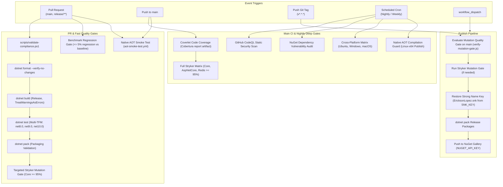

# CI/CD Pipeline & Quality Engineering Guide — EricksonLopez.Webhooks

Comprehensive architectural reference for build engineering, continuous integration, continuous delivery (CI/CD), quality gates, and supply chain security across the `dotnet-webhooks` repository.

---

## 1. CI/CD Lifecycle Topology

---

## 2. GitHub Actions Workflows Catalog

The repository maintains **8 specialized workflows** under `.github/workflows/`:

| Workflow File | Name | Triggers | Primary Objectives & Gates | Secrets Required | Artifacts Produced |
|---|---|---|---|:---:|---|
| [`main.yml`](../.github/workflows/main.yml) | Main Continuous Integration & Quality Gates | `push: [main]` | Multi-TFM build, Coverlet code coverage collection, package creation, and full Stryker mutation matrix (break at 95%). | None | `code-coverage-reports`, `nuget-packages`, `stryker-report-*` |
| [`pr-checks.yml`](../.github/workflows/pr-checks.yml) | PR Fast Checks & Compliance | `pull_request: [main, release/**]` | Repository compliance audit (`validate-compliance.ps1`), code format verification, build, unit test execution, and targeted Stryker mutation gate on Core. | None | None |
| [`publish.yml`](../.github/workflows/publish.yml) | Publish NuGet Packages | `push: tags [v*.*.*]`, `workflow_dispatch` | Validates mutation gate on `main` via JavaScript evaluation, conditionally runs Stryker, restores Strong Name Key (`SNK_KEY`), packs Release, and pushes packages to NuGet Gallery. | `SNK_KEY`, `NUGET_API_KEY` | Release packages |
| [`security-scan.yml`](../.github/workflows/security-scan.yml) | Security & Vulnerability Analysis | `push: [main]`, `pull_request: [main]`, `schedule: [0 4 * * 1]` | GitHub CodeQL static code analysis (C#) and NuGet transitive dependency vulnerability audit (`dotnet list package --vulnerable`). | None | CodeQL security alerts |
| [`benchmark-regression-gate.yml`](../.github/workflows/benchmark-regression-gate.yml) | Benchmark Regression Gate | `pull_request: [main, develop]`, `workflow_dispatch` | Restores SNK, compiles in Release, executes BenchmarkDotNet harness, and evaluates regression against `baseline.json` (max 5% latency regression). | `SNK_KEY` | `pr-benchmark-results-*` |
| [`mutation-testing.yml`](../.github/workflows/mutation-testing.yml) | Mutation Testing (Stryker) | `pull_request: [main]`, `push: [main]`, `schedule: [0 3 * * *]`, `workflow_call` | Matrix execution across Core, AspNetCore, and Redis with configurable mutation levels (Basic, Standard, Advanced). | Inherited | `stryker-report-*` |
| [`nightly.yml`](../.github/workflows/nightly.yml) | Nightly Deep Audit & Ecosystem Validation | `schedule: [0 3 * * *]`, `workflow_dispatch` | Cross-platform build/test matrix across Ubuntu, Windows, and macOS, plus Native AOT Linux-x64 compilation smoke test. | None | None |
| [`aot-smoke-test.yml`](../.github/workflows/aot-smoke-test.yml) | Native AOT Smoke Test | `push: [main]`, `pull_request: [main]` | Native AOT compilation smoke test publishing `samples/EricksonLopez.Webhooks.Sample` on `linux-x64` with `PublishAot=true`. | None | None |

---

## 3. Detailed Workflow Specifications

### A. `main.yml` (Continuous Integration)
- **Environment**: `ubuntu-latest`, .NET SDKs `8.0.x`, `9.0.x`, `10.0.x`.
- **Jobs**:
  1. `build-and-test`: Restores `EricksonLopez.Webhooks.slnx`, builds in `Release` configuration (`--no-restore`), runs tests with Coverlet collector (`--settings coverlet.runsettings --collect:"XPlat Code Coverage"`), packs Release binaries, and uploads coverage Cobertura XML and `.nupkg` artifacts.
  2. `mutation-matrix`: Installs `dotnet-stryker` global tool and executes full mutation testing across `tests/EricksonLopez.Webhooks.Tests` and `tests/EricksonLopez.Webhooks.AspNetCore.Tests` with `--concurrency 2 --break-at 95`.

### B. `pr-checks.yml` (Pull Request Fast Gate)
- **Environment**: `ubuntu-latest`, .NET SDKs `8.0.x`, `9.0.x`, `10.0.x`.
- **Jobs**:
  1. `compliance-and-build`: Executes `./scripts/validate-compliance.ps1`, checks formatting via `dotnet format --verify-no-changes`, compiles with `TreatWarningsAsErrors=true`, executes unit tests, and validates packability.
  2. `targeted-mutation-gate`: Uses GitHub Actions cache (`actions/cache@v4`) for Stryker baselines and executes targeted mutation testing on Core engine with `--break-at 95`.

### C. `publish.yml` (Release Pipeline)
- **Environment**: `ubuntu-latest`, permissions: `contents: read`, `id-token: write`.
- **Triggers**: Git tags matching `v*.*.*` or manual `workflow_dispatch`.
- **Step Breakdown**:
  1. `mutation-gate-check`: Runs `./scripts/verify-mutation-gate.js` via `actions/github-script@v7` to inspect recent commit statuses and determine whether Stryker verification on `main` passed.
  2. `stryker-gate`: Conditional job invoked via `uses: ./.github/workflows/mutation-testing.yml` if mutation gate needs execution.
  3. `publish`: Decodes `SNK_KEY` secret into `EricksonLopez.snk`, restores dependencies, packs release packages (`dotnet pack EricksonLopez.Webhooks.slnx -c Release`), and pushes `.nupkg` artifacts to `https://api.nuget.org/v3/index.json` using `--skip-duplicate` and `NUGET_API_KEY`.

### D. `benchmark-regression-gate.yml` (Performance Guard)
- **Environment**: `ubuntu-latest`, .NET SDKs `8.0.x`, `9.0.x`, `10.0.x`.
- **Execution**: Runs BenchmarkDotNet against `net10.0` with `--job short --exporters json --memory --artifacts ./benchmarks/pr-results`.
- **Assertion**: Runs `./scripts/verify-benchmark-gate.ps1` comparing PR results with `./benchmarks/results/baseline.json`. Fails the build if latency regresses beyond 5.0% or if any zero-allocation invariant is violated.

### E. `aot-smoke-test.yml` (Native AOT Fast Smoke Test)
- **Environment**: `ubuntu-latest`, .NET SDK `10.0.x`.
- **Triggers**: `push: [main]`, `pull_request: [main]`.
- **Execution**: Runs `dotnet publish samples/EricksonLopez.Webhooks.Sample/EricksonLopez.Webhooks.Sample.csproj -c Release -r linux-x64 -p:PublishAot=true`. Ensures zero dynamic reflection warnings or trimming errors on every PR and commit to `main`.

### F. `security-scan.yml` (Security & Vulnerability Analysis)
- **Environment**: `ubuntu-latest`, .NET SDKs `8.0.x`, `9.0.x`, `10.0.x`.
- **Triggers**: `push: [main]`, `pull_request: [main]`, `schedule: [0 4 * * 1]` (weekly on Monday).
- **Execution**: Runs GitHub CodeQL static analysis for C# and audits NuGet dependencies for known vulnerabilities via `dotnet list package --vulnerable --include-transitive`.

### G. `mutation-testing.yml` (Reusable & Nightly Mutation Matrix)
- **Environment**: `ubuntu-latest`, .NET SDKs `8.0.x`, `9.0.x`, `10.0.x`.
- **Triggers**: `pull_request`, `push`, nightly `schedule: [0 3 * * *]`, `workflow_dispatch`, `workflow_call`.
- **Execution**: Strategy matrix executing Stryker.NET across `tests/EricksonLopez.Webhooks.Tests`, `tests/EricksonLopez.Webhooks.AspNetCore.Tests`, and `tests/EricksonLopez.Webhooks.Redis.Tests`.

### H. `nightly.yml` (Cross-Platform Matrix & Deep Compilation Guard)
- **Environment**: Multi-OS matrix (`ubuntu-latest`, `windows-latest`, `macos-latest`), .NET SDKs `8.0.x`, `9.0.x`, `10.0.x`.
- **Triggers**: Nightly `schedule: [0 3 * * *]`, `workflow_dispatch`.
- **Execution**: Full build and test across all three major operating systems, plus full Native AOT compilation of benchmark harness with `--self-contained -p:PublishAot=true -p:TreatWarningsAsErrors=true`.

---

## 4. Quality Gates & Enforcement Mechanisms

### Code Coverage (Coverlet)
- **Configuration**: Managed centrally in [`coverlet.runsettings`](../coverlet.runsettings).
- **Format**: Cobertura XML format.
- **Exclusions**: Source-generated attributes (`GeneratedCodeAttribute`, `CompilerGeneratedAttribute`) and generated files (`**/obj/**/*.cs`, `**/*.g.cs`).

### Mutation Testing (Stryker.NET)
- **Configuration**: [`stryker-config.json`](../stryker-config.json).
- **Thresholds**:
  - `high`: 100%
  - `low`: 98%
  - `break`: 95% (Automated build failure if mutation score falls below 95%).
- **Ignored Methods**: Logging delegates (`*Log*`), telemetry metrics (`*SetTag*`, `*Record*`, `*Counter*.Add*`), and task scheduling (`ConfigureAwait`).

### Dependency Scanning (Dependabot)
- **Configuration**: [`.github/dependabot.yml`](../.github/dependabot.yml).
- **Schedules**: Weekly scans for `nuget` and `github-actions`.
- **Commit Prefixes**: `build(deps)` for NuGet dependencies, `ci(deps)` for Actions.

---

## 5. Branching & Release Strategy

### Branch Topology
- **`main`**: Production-ready branch. All merges require passing pull request checks, format validation, and mutation thresholds.
- **`release/**`**: Hardened release candidate branches.
- **`develop`**: Active staging integration for benchmark tracking.

### Semantic Versioning & Package Publishing
1. Versioning is governed by `VersionPrefix` in `Directory.Build.props` (currently `1.0.0`, Release: 2026-09-23).
2. Release tags follow Semantic Versioning (`vX.Y.Z`).
3. Publishing to NuGet is fully automated via `publish.yml` with strict gate validation and automatic symbol package (`.snupkg`) generation.

---

## 6. Supply Chain Security

1. **Strong Name Key Signing**: All distributed binaries are strongly named using an RSA-2048 key (`EricksonLopez.snk`). Public key token `002400000480...` is validated in `Directory.Build.props`.
2. **SourceLink**: Packages include `Microsoft.SourceLink.GitHub` (v8.0.0), embedding Git commit metadata for verifiable source debugging.
3. **Reproducible Builds**: All projects compile with `EmbedUntrackedSources=true` and `PublishRepositoryUrl=true`.
