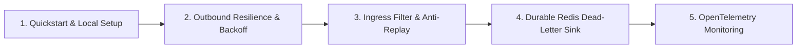

# Getting Started — EricksonLopez.Webhooks

A step-by-step onboarding and architecture adoption guide for software engineers and systems architects implementing `EricksonLopez.Webhooks` in enterprise microservices and cloud-native environments.

---

## Foundational Concepts & Invariants

1. **Timing Side-Channel Immunity**: Webhook signature verification must never employ standard short-circuit string equality comparisons (`==`, `string.Equals()`). `EricksonLopez.Webhooks` exclusively evaluates UTF-8 byte spans with `CryptographicOperations.FixedTimeEquals`.
2. **Anti-Replay Protection**: Every outbound request attaches a Unix timestamp and unique message identifier (`EventId` or `webhook-id`). Inbound receivers evaluate timestamp freshness against `TimeProvider` and track identifiers via `IWebhookReplayDetector`.
3. **SSRF Network Defense**: Outbound dispatches enforce connection-time IP validation via `SafeSocketsHttpHandlerFactory` and `EricksonLopez.Security.Network`, neutralizing DNS rebinding TOCTOU vulnerabilities and blocking internal RFC 1918 subnets.
4. **Non-Destructive Stream Buffering**: ASP.NET Core ingress middleware enables `request.EnableBuffering()` and resets `Body.Position = 0`, ensuring downstream controllers and Minimal APIs receive intact request body streams.
5. **Native AOT & Trimming**: Zero dynamic reflection; all JSON serialization utilizes compile-time source generation.

---

## Recommended Adoption Roadmap



---

### Step 1: Install NuGet Packages

Add the core engine and ASP.NET Core ingress package:

```bash
dotnet add package EricksonLopez.Webhooks
dotnet add package EricksonLopez.Webhooks.AspNetCore
```

If deploying to clustered environments requiring distributed anti-replay or dead-letter storage, install the Redis provider:

```bash
dotnet add package EricksonLopez.Webhooks.Redis
```

---

### Step 2: Configure the Outbound Dispatcher

Register the outbound webhook dispatcher in `Program.cs`:

```csharp
using EricksonLopez.Webhooks;

var builder = WebApplication.CreateBuilder(args);

builder.Services.AddWebhooks(options =>
{
    options.Timeout = TimeSpan.FromSeconds(10);
    options.MaxPayloadSizeBytes = 10 * 1024 * 1024; // 10 MB
    options.EnableSsrfProtection = true;
    options.AllowPrivateNetworks = false;
    options.DangerousAllowInsecureHttp = false;
});
```

---

### Step 3: Configure Inbound Webhook Reception & Replay Detection

Register the receiver validator and idempotency detector:

```csharp
using EricksonLopez.Webhooks.AspNetCore;

builder.Services.AddWebhookReceiver(options =>
{
    options.SecretKey = builder.Configuration["Webhooks:SecretKey"] ?? "whsec_primary_secret";
    options.TimestampTolerance = TimeSpan.FromMinutes(5);
    options.MaxPayloadSizeBytes = 2 * 1024 * 1024; // 2 MB
});

// For single-node deployments:
builder.Services.AddInMemoryReplayDetector(TimeSpan.FromMinutes(5));

// For clustered production deployments with Redis:
// builder.Services.AddRedisWebhookReplayDetector(TimeSpan.FromMinutes(5));
// builder.Services.AddRedisWebhookDeadLetterSink("webhooks:dead_letter_queue");
```

---

### Step 4: Secure Minimal APIs Routes

Apply declarative cryptographic signature verification to webhook endpoints using `.RequireWebhookSignature()`:

```csharp
var app = builder.Build();

var webhookGroup = app.MapGroup("/api/v1/webhooks")
    .RequireWebhookSignature();

webhookGroup.MapPost("/order-events", async (HttpContext context) =>
{
    // The request body stream is verified and intact
    using var reader = new StreamReader(context.Request.Body);
    var jsonPayload = await reader.ReadToEndAsync();
    
    // Process business logic safely
    return Results.Accepted();
});

app.Run();
```

---

### Step 5: Dispatch Webhooks from Outbox Workers

Inject `IWebhookSender` into background services or handlers:

```csharp
public class OrderNotificationWorker
{
    private readonly IWebhookSender _sender;

    public OrderNotificationWorker(IWebhookSender sender)
    {
        _sender = sender;
    }

    public async Task NotifyCustomerAsync(Uri customerUrl, string secretKey, string orderJson, CancellationToken ct)
    {
        var message = new WebhookMessage(
            customerUrl,
            new WebhookSecret(secretKey),
            "order.created",
            $"evt_{Guid.NewGuid():N}",
            orderJson);

        var result = await _sender.SendAsync(message, ct);

        if (result.IsFailure)
        {
            // Failures exceeding retries are automatically escalated to IWebhookDeadLetterSink
            Console.WriteLine($"Delivery failed: [{result.Error.Code}] {result.Error.Description}");
        }
    }
}
```
